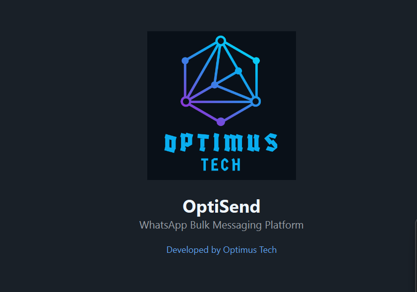
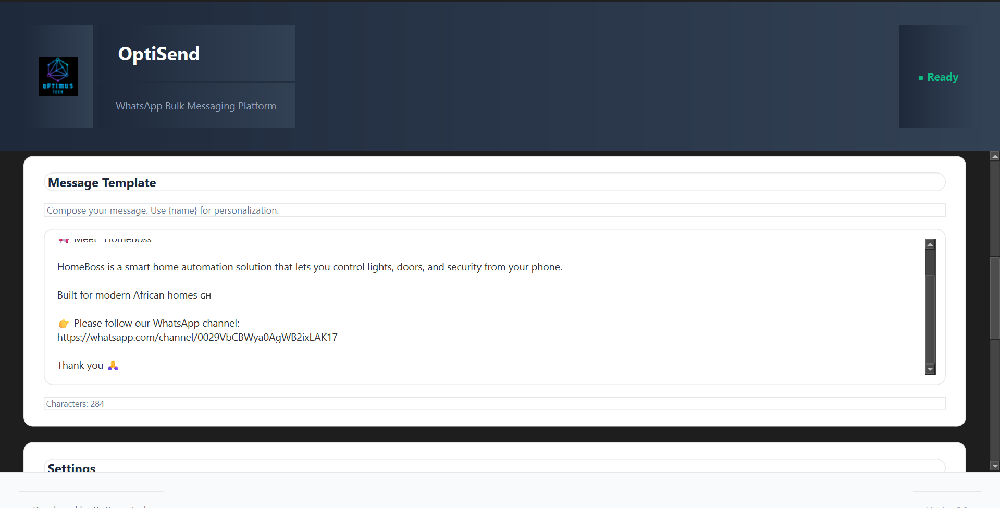

# OptiSend 📨

<div align="center">


**Professional WhatsApp Bulk Messaging Platform**

[](https://www.python.org/downloads/)
[](https://pypi.org/project/PyQt6/)
[](LICENSE)
[](https://github.com/yourusername/optisend)

*Developed by Optimus Tech*

[Download Latest Release](#-download) • [Documentation](#-features) • [Installation](#-installation) • [Support](#-support)

</div>

---

## 🚀 Overview

OptiSend is a modern, enterprise-grade desktop application designed for efficient WhatsApp bulk messaging campaigns. Built with Python and PyQt6, it offers a professional user interface with advanced contact management and real-time campaign monitoring.

### ✨ Key Highlights

- 🎨 **Modern UI/UX** - Professional splash screen, card-based design, smooth animations
- 📂 **Dual Contact Management** - CSV import or manual entry with built-in table editor
- ✉️ **Message Personalization** - Dynamic `{name}` placeholder support
- 📊 **Real-time Monitoring** - Live progress tracking and detailed activity logs
- ⚡ **High Performance** - Non-blocking threaded operations, never freezes
- 🔒 **Smart Rate Limiting** - Configurable delays to prevent WhatsApp restrictions
- 💾 **Export Functionality** - Save manually entered contacts to CSV
- 🌍 **Cross-Platform** - Works on Windows, Linux, and macOS

---

## 📸 Screenshots

<div align="center">

### Splash Screen


### Main Interface


</div>

---

## 🎯 Features

### Contact Management
- **CSV Import**: Bulk import contacts from CSV files
- **Manual Entry**: Add contacts one-by-one with validation
- **Contact Table**: View, edit, and manage all contacts
- **Export to CSV**: Save manual contacts for future use
- **Remove/Clear**: Delete individual or all contacts

### Message Composition
- **Rich Text Editor**: Full-featured message composer
- **Personalization**: Use `{name}` placeholder for dynamic names
- **Character Counter**: Track message length in real-time
- **Template Support**: Save and reuse message templates

### Campaign Management
- **Progress Tracking**: Real-time progress bar with stats
- **Activity Log**: Timestamped logs for all actions
- **Success/Failure Tracking**: Detailed status for each message
- **Configurable Delays**: 3-60 second delays between messages
- **Pause/Resume**: Stop and restart campaigns

### Technical Features
- **Thread-Safe Operations**: UI never freezes during campaigns
- **Automatic Phone Formatting**: Handles multiple phone number formats
- **Error Handling**: Graceful handling of invalid contacts
- **Selenium Integration**: Reliable WhatsApp Web automation
- **Chrome Driver Management**: Automatic driver updates

---

## 💻 Download

### Pre-built Executable (Recommended)

**Windows Users**: Download the ready-to-use executable

📥 **[Download OptiSend.exe](https://github.com/OptimusO7/optisend/releases/latest/download/OptiSend.exe)** (v2.0)

> **Note**: Windows SmartScreen may show a warning. Click "More info" → "Run anyway". This is normal for unsigned applications.

### Source Code

```bash
git clone https://github.com/yourusername/optisend.git
cd optisend
pip install -r requirements.txt
python main.py
```

---

## 🛠️ Installation

### Option 1: Use Pre-built Executable (No Installation Required)

1. Download `OptiSend.exe` from [Releases](https://github.com/OptimusO7/Optisend/releases)
2. Place it in any folder
3. Double-click to run
4. No Python or dependencies needed!

### Option 2: Run from Source

#### Prerequisites
- Python 3.8 or higher
- Chrome browser installed
- pip (Python package manager)

#### Steps

1. **Clone the repository**
```bash
git clone https://github.com/yourusername/optisend.git
cd optisend
```

2. **Install dependencies**
```bash
pip install -r requirements.txt
```

3. **Run the application**
```bash
python main.py
```

---

## 📖 Usage Guide

### Quick Start

1. **Launch OptiSend**
   - Run `OptiSend.exe` or `python main.py`
   - Wait for splash screen to load

2. **Add Contacts** (Choose one method)
   - **CSV Import**: Click "CSV Import" tab → Browse Files → Select CSV
   - **Manual Entry**: Click "Manual Entry" tab → Add Contact → Fill form

3. **Compose Message**
   - Write your message in the template editor
   - Use `{name}` for personalization (e.g., "Hi {name}!")

4. **Configure Settings**
   - Set delay between messages (recommended: 5-10 seconds)

5. **Start Campaign**
   - Click "🚀 Start Campaign"
   - Scan QR code when WhatsApp Web opens (20 seconds)
   - Monitor progress in real-time

### CSV File Format

Your CSV must have these columns:

```csv
name,number
John Doe,0241234567
Jane Smith,233501234567
Bob Wilson,0551234567
```

**Supported Phone Formats:**
- `0241234567` (Ghana format with leading 0)
- `233241234567` (International format)
- `241234567` (9-digit format)

> The app automatically formats Ghanaian numbers. To support other countries, modify `format_phone_number()` in `whatsapp_bot.py`.

### Manual Contact Entry

1. Click "✍️ Manual Entry" tab
2. Click "➕ Add Contact"
3. Enter name and phone number
4. Click OK
5. Repeat for each contact
6. Optional: Export to CSV for backup

---

## 🏗️ Project Structure

```
optisend/
├── main.py                 # Application entry point
├── splash_screen.py        # Splash screen with branding
├── main_window.py          # Main UI and logic
├── whatsapp_bot.py         # WhatsApp automation engine
├── requirements.txt        # Python dependencies
├── optimus.png            # Logo file
├── build_exe.bat          # Windows build script
├── build_exe.sh           # Linux/Mac build script
├── convert_icon.py        # Icon converter utility
└── README.md              # This file
```

---

## 🔧 Building from Source

### Create Executable

**Windows:**
```bash
# Install PyInstaller
pip install pyinstaller

# Run build script
build_exe.bat

# Find EXE at: dist\OptiSend.exe
```

**Linux/Mac:**
```bash
# Install PyInstaller
pip3 install pyinstaller

# Make script executable
chmod +x build_exe.sh

# Run build script
./build_exe.sh

# Find executable at: dist/OptiSend
```

### Manual Build Command

```bash
pyinstaller --onefile --windowed \
    --name "OptiSend" \
    --icon=optimus.ico \
    --add-data "optimus.png;." \
    --hidden-import=selenium \
    --hidden-import=pandas \
    --hidden-import=PyQt6 \
    --noconsole \
    main.py
```

See [BUILD.md](BUILD.md) for detailed build instructions.

---

## ⚙️ Configuration

### Delay Settings
- **Minimum**: 3 seconds (risky)
- **Recommended**: 5-10 seconds
- **Safe**: 10-15 seconds
- **Very Safe**: 15-30 seconds

Higher delays reduce the risk of WhatsApp account restrictions.

### Phone Number Formatting

Default: Ghana (+233)

To change country code, edit `whatsapp_bot.py`:

```python
def format_phone_number(self, phone):
    # Change 233 to your country code
    if phone.startswith("0"):
        phone = "233" + phone[1:]  # Replace 233 with your code
    elif len(phone) == 9:
        phone = "233" + phone      # Replace 233 with your code
    return phone
```

---

## 🛡️ Safety & Best Practices

### Important Guidelines

⚠️ **Use Responsibly**
- Only message contacts who have given permission
- Respect WhatsApp Terms of Service
- Follow anti-spam regulations
- Be aware of privacy laws

### Avoiding Account Restrictions

✅ **Do:**
- Start with small batches (10-20 contacts)
- Use delays of 5+ seconds
- Personalize messages with names
- Test thoroughly before large campaigns
- Use WhatsApp Business if available

❌ **Don't:**
- Send to random/purchased contact lists
- Use very short delays (<3 seconds)
- Send identical messages to everyone
- Run campaigns 24/7
- Ignore WhatsApp warnings

### Account Safety Tips

1. **Warm Up**: Start with small campaigns
2. **Vary Timing**: Don't send at exact intervals
3. **Monitor**: Watch for WhatsApp warnings
4. **Rest**: Give your account breaks between campaigns
5. **Quality Over Quantity**: Better engagement > more messages

---

## 🐛 Troubleshooting

### Common Issues

<details>
<summary><b>❌ "Chrome driver not found"</b></summary>

**Solution**: 
- Ensure Chrome browser is installed
- Check internet connection (driver downloads automatically)
- Update Chrome to latest version
</details>

<details>
<summary><b>❌ "Failed to send message"</b></summary>

**Solution**:
- Verify phone number is correct
- Check WhatsApp Web is logged in
- Increase delay between messages
- Ensure contact hasn't blocked you
</details>

<details>
<summary><b>❌ "CSV file not loading"</b></summary>

**Solution**:
- Verify columns are named `name` and `number`
- Check for empty rows
- Ensure UTF-8 encoding
- Remove special characters
</details>

<details>
<summary><b>❌ "Logo not showing"</b></summary>

**Solution**:
- Ensure `optimus.png` is in same folder as EXE
- Rebuild EXE with `--add-data` flag
- Check file name matches exactly
</details>

<details>
<summary><b>❌ Windows SmartScreen blocks EXE</b></summary>

**Solution**:
- Click "More info"
- Click "Run anyway"
- This is normal for unsigned executables
- Or run from source code
</details>

### Getting Help

1. Check [Issues](https://github.com/OptimusO7/Optisend/issues) for similar problems
2. Review [Troubleshooting Guide](docs/TROUBLESHOOTING.md)
3. Create a new issue with:
   - Operating system
   - Python version (if running from source)
   - Error messages
   - Steps to reproduce

---

## 📦 Dependencies

### Runtime Dependencies
- `PyQt6` - GUI framework
- `selenium` - WhatsApp Web automation
- `pandas` - CSV processing
- `webdriver-manager` - Chrome driver management

### Build Dependencies
- `pyinstaller` - Executable creation
- `pillow` - Icon conversion

See `requirements.txt` for exact versions.

---

## 🗺️ Roadmap

### Version 2.1 (Planned)
- [ ] Message scheduling
- [ ] Multiple CSV file support
- [ ] Campaign templates
- [ ] Statistics dashboard
- [ ] Dark/Light theme toggle

### Version 2.2 (Future)
- [ ] Media attachment support (images/videos)
- [ ] Contact groups
- [ ] Message delivery confirmation
- [ ] Multi-language support
- [ ] Cloud backup integration

### Version 3.0 (Vision)
- [ ] WhatsApp Business API integration
- [ ] Multi-account support
- [ ] Advanced analytics
- [ ] A/B testing
- [ ] Team collaboration features

---

## 🤝 Contributing

We welcome contributions! Here's how you can help:

### Ways to Contribute
- 🐛 Report bugs
- 💡 Suggest features
- 📝 Improve documentation
- 🔧 Submit pull requests
- ⭐ Star the repository

### Development Setup

1. Fork the repository
2. Create a feature branch (`git checkout -b feature/amazing-feature`)
3. Commit changes (`git commit -m 'Add amazing feature'`)
4. Push to branch (`git push origin feature/amazing-feature`)
5. Open a Pull Request

### Code Guidelines
- Follow PEP 8 style guide
- Add docstrings to functions
- Include type hints where possible
- Test thoroughly before submitting
- Update documentation

---

## 📄 License

This project is proprietary software developed by **Optimus Tech**. 

**Rights Reserved**: This software is provided for evaluation and personal use. Commercial use, redistribution, or modification requires explicit permission from Optimus Tech.

For licensing inquiries, contact: [osbornnartey7@gmail.com](mailto:osbornnartey7@gmail.com)

---

## ⚖️ Disclaimer

This tool is intended for **legitimate business communication only**. Users are solely responsible for:

- Obtaining recipient consent before messaging
- Complying with WhatsApp Terms of Service
- Following local anti-spam regulations
- Respecting privacy laws (GDPR, etc.)
- Ensuring message content is legal and appropriate

**Misuse Warning**: Improper use of this tool may result in:
- WhatsApp account restrictions or bans
- Legal consequences
- Reputation damage

Optimus Tech is not liable for misuse of this software.

---

## 🌟 Acknowledgments

- **PyQt6** - Cross-platform GUI framework
- **Selenium** - Browser automation
- **pandas** - Data processing
- **webdriver-manager** - Simplified driver management
- **Anthropic Claude** - Development assistance

---

## 📞 Support

### Get Help
- 📧 Email: osbornnartey7@gmail.com
- 💬 Issues: [GitHub Issues](https://github.com/OptimusO7/optisend/issues)


### Community
- ⭐ Star this repo to show support
- 🔔 Watch for updates
- 🍴 Fork to contribute
- 💬 Discuss in Issues

---

## 📊 Statistics


---

<div align="center">

### Made with ❤️ by Optimus Tech

**OptiSend v2.0** | Professional WhatsApp Bulk Messaging Platform

[⬆ Back to Top](#optisend-)

---

© 2024 Optimus Tech. All rights reserved.

</div>
